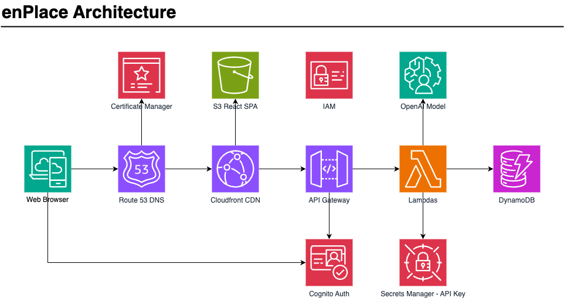

# enPlace

A better way to save and follow recipes. Built with a serverless architecture on AWS (API Gateway, Lambdas, DynamoDB), the OpenAI API, React, and Terraform.

Try out the app at [enplace.xyz](https://www.enplace.xyz/)!



## Local Setup

1. [Sign up for an OpenAI API Key](https://platform.openai.com/docs/quickstart/account-setup) and export it as the `TF_VAR_openai_api_key` variable in your `.bashrc` or `.zshrc`
2. Ensure [docker](https://docs.docker.com/get-docker/) and [jq](https://jqlang.github.io/jq/) are installed
3. Navigate to `/infra` and run `terraform init`
4. Navigate to `/infra/local` and run `init.sh` to launch the backend services in a LocalStack contaner
5. Set up the backend Python environment (used for formatting and E2E tests):
   ```
   cd backend
   python3 -m venv myenv
   pip install -r requirements_dev.txt -r tests/requirements.txt
   ```
6. Navigate to `/frontend` and run `npm install`
7. Launch the frontend with `npm run dev`
8. This project uses custom git hooks - you can enable them by navigating to `.githooks` and running `init.sh` (this requires the Python environment from step 5, since the hook runs `black` on the backend code)

## Running E2E Tests

The `backend` E2E suite spins up a throwaway LocalStack container, deploys the real Terraform infra (lambda + API Gateway + DynamoDB) into it, and exercises every API route.

1. Complete steps 1-5 of Local Setup above (Python environment must be set up)
2. Navigate to `/infra/local` and run `./e2e_test.sh`

The script tears down the LocalStack container automatically when it finishes, and dumps its logs if a test fails.
